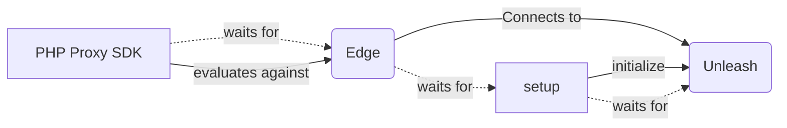

To run the sample:
- `docker compose up evaluate`

Then you can login to unleash at 4242 and check the metrics of the toggle created.

# What is happening?
1. Spin up unleash-server with a postgres DB
2. Run a setup.sh script to create toggles, turn it on in development and generate a frontend token that later will be used by the php proxy 
3. After setting up unleash-server, spin up an edge instance connected to unleash
4. Run a php proxy that will connect to unleash edge and use the frontend token to authenticate to unleash-server. The php proxy uses a persistent cache so metrics are not lost when the php proxy container restarts. 

